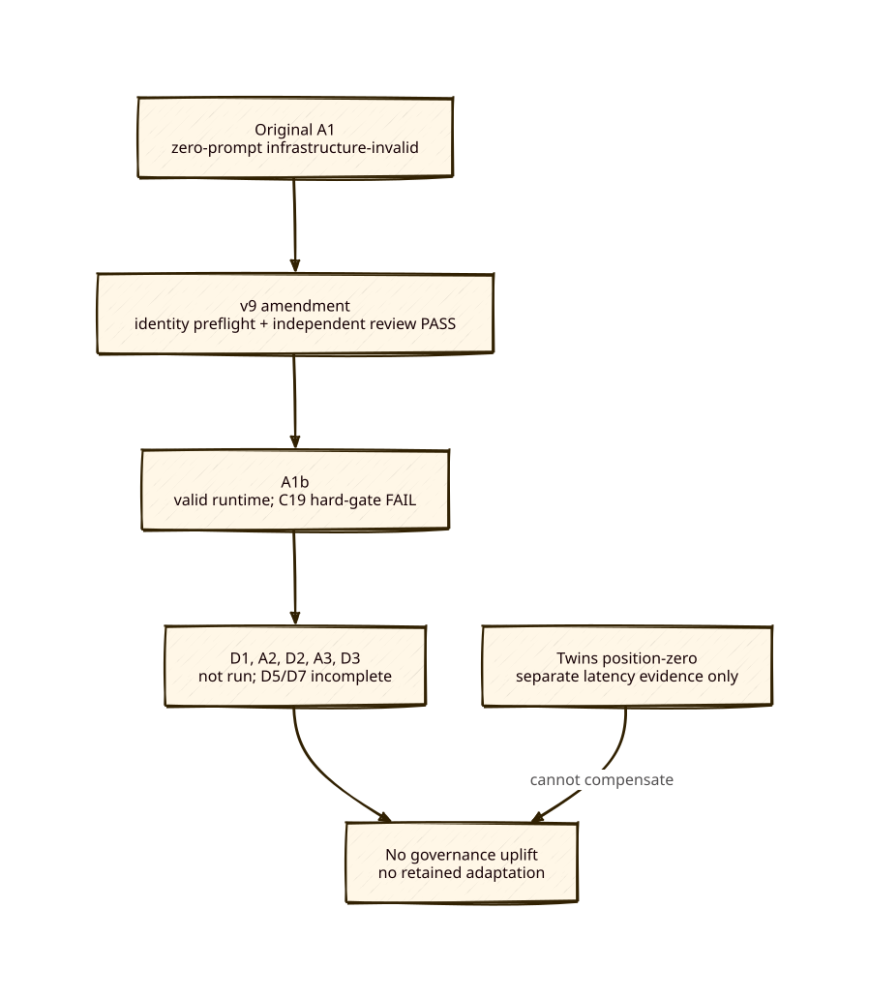

# c01 v9 final outcome — no governance uplift

**Status:** CLOSED — no governance-uplift claim and no retained adaptation
**Decision:** A valid A1b run failed frozen C19. The serial c01 contract stops the matrix; all results and non-results below are preserved without retry or substitution.

## Diagram

## Published evidence

- Full immutable raw bundles are tracked at `docs/c01-v9-raw/original-a1-infrastructure-invalid/`, `docs/c01-v9-raw/a1b/`, and `docs/c01-v9-raw/position-zero-twins-20260811T1135Z/`; ignored originals remain preserved in place. The A1b result and manifest snapshots remain at `docs/c01-v9-evidence/a1b-result.json` and `a1b-manifest.json`.
- The mandated review PASS and its authoritative Pi session identity are tracked at `docs/c01-v9-evidence/independent-review-8081-twins.md` and `independent-review-8081-twins-identity.md`; the original zero-prompt A1 record is tracked at `docs/c01-v9-evidence/original-a1-infrastructure-invalid.md`.
- A1b delivered three prompts, exited 0, passed frozen/runtime identities 34/34, and failed C19 only: `yaml_historical=False`. See the tracked result snapshot.
- The c01 identity amendment is integrated on `main`: `33d8440`, `eac131b`, and `b376b9b`, limited to the runner, contract, alias map, and matching tests. `npm run precommit` passed after integration; the c01 contract manifest verifies.
- The original `c01-prestagec-a1-r1` is retained as a zero-prompt infrastructure-invalid predecessor; it is not behavior evidence and is not retried.

## Coverage and decision boundary

| Requirement | Coverage | Result |
| --- | --- | --- |
| Pre-Stage-C matrix | A1b run; D1/A2/D2/A3/D3 **0/5** | Hard-gate stop after A1b; later IDs remain unconsumed. |
| D1 | A1b descriptive only: 0/5 eligible carries supplied | Not a complete matrix result. |
| D5 | 0 blinded bundles | No D5 comparison or no-regression finding. |
| D7 | A1b latency/M8 only | No paired complete matrix or margin finding. |
| Governance uplift | All frozen gates + D5 + D7 required | **Not established**; C19 failed. |

The remaining cells are intentionally unexecuted, rather than missing work: the frozen serial closure requires stopping on C19. No later adaptation can alter that frozen A1b outcome.

## Adaptations

Two isolated candidates ran and neither is retained:

1. Candidate 1 is invalid: its deliberation identity resolved to external `google/gemini-3.5-flash`, and the smart extractor skipped the changed navigator lens. Its second run was not consumed.
2. Candidate 2 used only `olla/qwen36-27b-nvidia-nvfp4`, passed C19/C20, but still skipped the state-changing supersession injection. Its mechanism is inconclusive and its second run is not consumed.

Both candidates occurred only after the C19 hard-gate pause and explicit user authorization; their control boundary is tracked at `docs/c01-v9-evidence/hard-gate-stop-and-adaptation-authorizations.md`. No third candidate is warranted because it cannot produce the required passing frozen c01 matrix. Candidate r1 snapshots are tracked at `docs/c01-v9-evidence/candidate-1-r1-result.json` and `candidate-2-r1-result.json`; neither candidate branch is merged.

## Separate Twins position-zero replication

The tracked `findings-position-zero.md` reports the completed six-process/30-request replication at `http://twins:8081/v1`, model `qwen36-27b-nvidia-nvfp4`. Its immutable checksum ledger is tracked at `docs/c01-v9-evidence/position-zero-twins-SHA256SUMS.txt`, with all raw process artifacts at `docs/c01-v9-raw/position-zero-twins-20260811T1135Z/`.

Twins push warm medians were 2.666–2.950s and splice 17.841–18.192s; one 49-token push response is retained as a qualification. No cache-token telemetry was emitted. This is endpoint/model-specific latency evidence only; it cannot compensate for c01’s C19 governance failure and is not pooled with the preserved `127.0.0.1:4321` attempts.

## Verification note

After independent audit found two non-hermetic identity-failure tests, the tests were changed to use private temporary targets and the contract manifest was rehashed. This post-A1b maintenance change alters no runner behavior, prompts, run IDs, scenario, raw evidence, or A1b result; A1b retains its original pinned contract/test hashes in its manifest. The current c01 Python suite passes with preserved A1b paths present, and the current contract manifest verifies.
