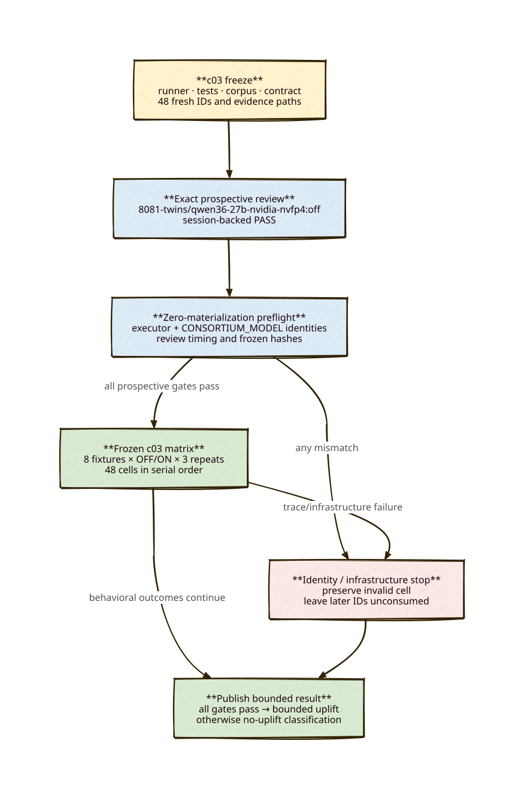

# c03 supersession-guard uplift preregistration

> **Status:** PROPOSED FREEZE — no c03 preflight, workspace, or prompt until the committed exact review gate passes.
> **Scope:** Fresh c03 IDs/evidence only. c02 remains permanently identity-invalid/no-uplift.

## Objective

Test whether the default-off deterministic state-supersession guard improves historical preservation on four named positive fixtures without firing on four matched controls, using `8081-twins/qwen36-27b-nvidia-nvfp4:off` for both executor and consortium deliberation.

## Diagram



## Frozen identities

- Pi CLI: exactly `0.84.1`.
- Node: `v22.23.*`.
- Executor command: provider `8081-twins`, model `qwen36-27b-nvidia-nvfp4`, thinking `off`.
- Child environment: explicit `CONSORTIUM_MODEL=8081-twins/qwen36-27b-nvidia-nvfp4`; ambient values are overwritten.
- Post-run trace: every `deliberation_start` must record model `8081-twins/qwen36-27b-nvidia-nvfp4` and source `CONSORTIUM_MODEL`.

Any mismatch before prompt 1 stops preflight. Any mismatch observable only after a consumed cell preserves that cell as identity-invalid and stops before the next cell.

## Corpus and schedule

`scripts/behavioral-parcour/c03-supersession-corpus.json` owns the c03 copy of eight fixtures: four positive supersession fixtures and four matched controls, each with three fixed prompts. c02 artifacts are not c03 gates or repetitions.

The runner generates exactly this serial order for each repetition:

```text
yaml-markdown OFF, ON
policy-retirement OFF, ON
requirement-replacement OFF, ON
state-format-migration OFF, ON
state-formatting-control OFF, ON
policy-clarification-control OFF, ON
requirement-addition-control OFF, ON
state-comment-control OFF, ON
```

Repeat that order for r1, r2, and r3: 48 fresh cells. Behavioral failures continue through all frozen repetitions. Identity, review, preflight, infrastructure, safety, or raw-evidence failure stops the cycle.

## Gates before prompt 1

1. Commit the c03 runner, tests, corpus, contract, preregistration, diagram, 48 raw destinations, and unconsumed ledger.
2. Pass c03 unit tests, contract verification, full test/typecheck, and `npm run precommit`.
3. Complete a new RLM review under exactly `8081-twins/qwen36-27b-nvidia-nvfp4:off` after the c03 freeze; commit its raw output and Pi session JSONL.
4. Preflight verifies the committed contract at the freeze commit, review identity/verdict/timing, Pi/Node, executor command, extension order, and effective child environment before materialization.
5. `--preflight-only` must leave every `/tmp/parcour-c03-*` and `.parcour-runs/c03-*` path absent.

A later review, rehash, source correction, provider substitution, or copied c02 evidence cannot cure a consumed c03 cell.

## Bounded uplift gates

All are required:

1. All 48 cells have valid prospective and post-run identities plus complete raw evidence.
2. ON records the exact supersession-guard reason on all 12 positive cells; OFF never records it.
3. ON passes continuity on at least 11/12 positive cells and exceeds paired OFF by at least four cells.
4. ON records zero supersession-guard fires on all 12 controls.
5. Report per-cell wall time and tool-call count. Make no cost claim without complete provider-usage coverage.

If any gate fails, publish invalid/negative/mixed/no-uplift evidence. The guard remains default-off even after a bounded positive result; rollout requires separate approval.
