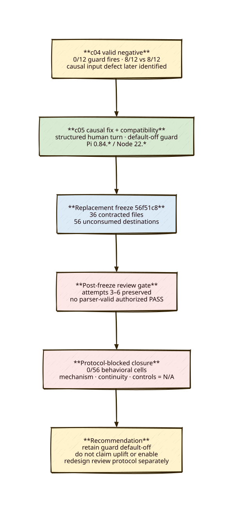

# c05 final outcome — protocol-blocked, no behavioral evidence

**Status:** CLOSED RECOMMENDATION — the final authorized review attempt failed its explicit format gate. No c05 smoke or matrix prompt ran. c05 provides no mechanism, continuity, control, or uplift result.

## Diagram

## Classification

This is **protocol-blocked**, not mechanism-failed and not no-uplift. The c05 causal fix, patch-compatible runtime package, contract, and current Pi 0.84.2 schema evidence passed deterministic and repository gates, but replacement freeze `56f51c8` never obtained an authorized format-valid prospective review.

| Measure | c05 result |
|---|---:|
| Frozen scheduled IDs | 56 |
| Behavioral cells executed | 0 |
| User prompts delivered | 0 |
| Consumed ledger records | 0 |
| Non-placeholder raw files | 0 |
| Smoke mechanism denominator | N/A |
| Matrix ON/OFF continuity | N/A |
| Control regressions | N/A |
| Bounded uplift | Not established |

## Evidence chain

- Accepted Phase 0-B remains `docs/c05-evidence/phase0-capability-b/`; attempt 1 remains harness-invalid.
- Causal-path fix and compatibility runner passed 50 c05 Python tests, 448 repository tests, typecheck, and zero production audit vulnerabilities before replacement freeze `56f51c8`.
- Fresh Pi `0.84.2` compatibility evidence at `docs/c05-evidence/c05-patch-compatibility-schema-0842/` records exactly two `get_state` controls, zero prompts, both nested identities valid, 13/13 checks, and process exit 0.
- Freeze `56f51c8` verifies 36 contracted files, 56 unconsumed ledger records, 56 empty raw placeholders, and no scheduled runtime roots.
- Review attempts are preserved without repair:
  - attempt 1: timeout, zero tokens;
  - attempt 2: PASS for superseded freeze `360a05b` only;
  - attempt 3: connection failure, zero tokens;
  - attempt 4: BLOCK after guessed artifact paths;
  - attempt 5: substantive PASS, rejected because `### BLOCKER: None` failed the frozen regex;
  - attempt 6: substantive PASS, rejected because prose preceded the required first-byte verdict block.

Attempt 6 exhausted the explicitly authorized retry budget. Its evidence is `docs/c05-evidence/independent-review-attempt-6-format-invalid.md` plus the raw session/output/stderr alongside it.

## Recommendation

**Retain the supersession guard default-off; do not enable it and do not claim uplift.** c04’s valid negative result was confounded at the intended causal mechanism by the later-verified structured-user-input defect, while c05 never reached behavioral execution. Removing the now-fixed guard would also be unsupported by c05 evidence.

If this question is revisited, use a separately authorized protocol with machine-produced structured review metadata rather than natural-language formatting as an execution gate. Do not continue this c05 lineage with attempt 7 or retrospective parser/session edits.
