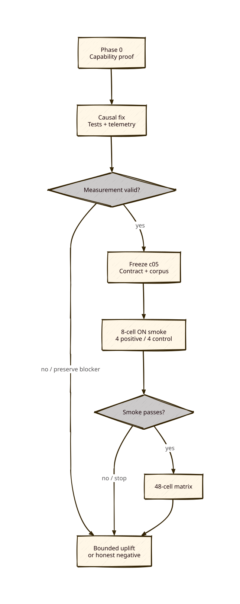

# c05 status

**Status:** Freeze `360a05b` committed; authorized post-freeze review attempt 2 passed exact session validation; preflight next; no behavioral prompt started
**As-of:** 2026-08-13

## Diagram

## Goal

Diagnose and minimally fix the supersession guard’s inactive causal path, then establish or reject bounded continuity uplift with fresh c05 evidence.

## Verified facts

- c04 remains unchanged and is the immutable valid-negative baseline.
- All eight inspected c04 repetition-one ON sessions encode human input as Pi text-part arrays.
- `src/core.ts` previously selected only string-valued user messages, producing an empty guard input while extraction independently recognized supersession.
- Two regression tests first failed with only extraction executed, then passed after normalizing the latest human user turn and excluding `[CONSORTIUM DELIBERATION]` synthetic messages.
- Runtime telemetry now records effective guard value, its settings provenance, and normalized turn length without logging turn text.
- A production-registration test proves workspace settings yield `state_supersession_guard=true`, source `workspace_settings`, and nonzero structured-turn length.
- Capability-first Phase 0 helpers and zero-user-prompt probe have 13/13 deterministic tests passing.
- Full repository gate passes: typecheck, 448/448 tests, and zero audit vulnerabilities.
- The first live Phase 0 attempt proved exact runtime identity and sent only two `get_state` controls, but independent audit found its publication dry-run tested `docs/c05-phase0-capability` rather than the actual `docs/c05-evidence/phase0-capability` destination.
- That attempt remains preserved as harness-invalid at `docs/c05-evidence/phase0-capability/`.
- Authorized attempt 2 uses fresh ID `c05-phase0-capability-b`; its plan records `docs/c05-evidence/phase0-capability-b`, dry-runs that exact destination, and fails unless returned and planned destinations match.
- The c05-owned eight-fixture corpus preserves all c04 fixture content and ordering; only `requirement-replacement` adds the authorized separator-equivalence scoring metadata.
- The c05 scorer accepts `release notes`/`release-notes` only when Markdown is affirmatively current, YAML is explicitly historical/superseded, and `RELEASE_STREAM=stable`; all six tracked historical outputs pass and adversarial negated-current forms fail.
- Attempt 2 ran once from committed harness `ff1a85e`; exactly two `get_state` controls returned the required nested identity and the exact tested publication destination was used byte-identically.
- Independent executable audit passed all Phase 0 gates and independently ran 17/17 c05 Python tests; full repository checks remain 448/448 tests with zero audit vulnerabilities.
- The complete c05 protocol froze at `360a05b04f2c0ec7be544a731b7da2a1cf741503`: 29 contracted immutable files, 8 smoke IDs, 48 matrix IDs, 56 unconsumed ledger records, and 56 empty raw placeholders.
- Committed-byte verification passed, as did all c05 Python tests and the full repository gate (typecheck, 448/448 tests, zero audit vulnerabilities).
- Post-freeze review attempt 1 used observed identity `8081-twins/qwen36-27b-nvidia-nvfp4:off`, but produced zero tokens and no verdict after timeout/connection errors.
- Attempt 1 is preserved under `docs/c05-evidence/independent-review-attempt-1-timeout*` and is infrastructure-invalid.
- Per the frozen review gate, no retry, preflight, smoke prompt, or matrix prompt occurred; all 56 IDs remain unconsumed and all raw placeholders remain empty.
- All transient/cache writes are confined beneath the repository’s ignored `.parcour-runs/` path.

## Compatibility policy

- Node and Pi versions are recorded as provenance; compatibility accepts Node 22+ and the package-supported Pi range `>=0.74.0,<1.0.0` before capability checks.
- Provider/model/thinking identity is never inferred from version or command construction: live nested `get_state` must prove it.
- Child `CONSORTIUM_MODEL` is always overwritten with `8081-twins/qwen36-27b-nvidia-nvfp4`, including when ambient state points to Google.
- Extension existence and SHA-256, exact settings location/payload, reviewer command shape, repository path confinement, and zero-prompt RPC methods are checked explicitly.

## Current gate

After explicit resume with the exact model available, one fresh review attempt was executed under `8081-twins/qwen36-27b-nvidia-nvfp4:off`. Attempt 2 returned `HEADLINE: PASS` and `BLOCKER: None`; `c05_runner.validate_review()` accepted its exact timestamp, raw-session hash, provider/model/thinking events, and verdict. Evidence is under `docs/c05-evidence/independent-review-attempt-2*` with canonical metadata at `docs/c05-evidence/independent-review.json`. Attempt 1 remains unchanged. No preflight or scheduled prompt has run yet.
