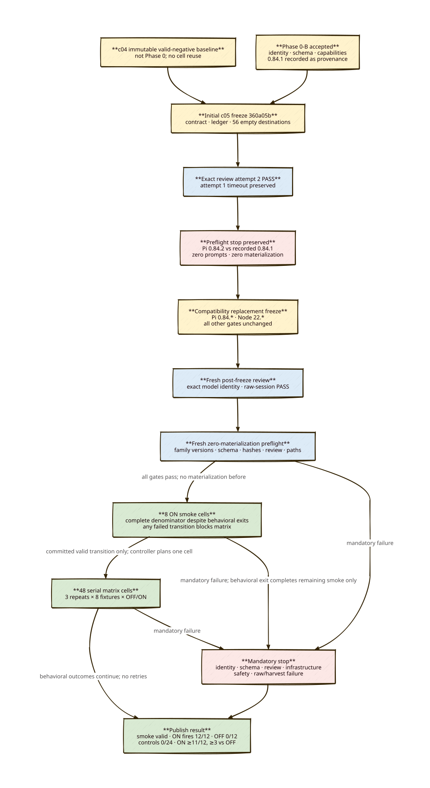

# c05 supersession-guard preregistration

> **Status:** PROPOSED FREEZE — no review, preflight, prompt, or execution target may run until this package is committed and its exact post-freeze review passes.
> **Scope:** Fresh c05 IDs/evidence only. c04 is retained as the immutable valid-negative baseline; no c04 cell is repeated or reused.

## Objective

Test the default-off explicit durable-state supersession guard after correcting the c04 `requirement-replacement` continuity scorer’s separator defect. c04 was a valid negative experiment: ON fired on 0/12 positive cells and ON/OFF continuity was 8/12 each. c05 isolates the scorer correction while retaining c04 fixture text, prompts, arms, repetitions, identity, and controls.

## Causal correction and corpus boundary

The c04 scorer recognized only the literal `release-notes` spelling. The corpus’s `requirement-replacement` prompt asks for `release-notes`, but compliant output may contain `release notes`; this creates a false negative when current/historical framing and `RELEASE_STREAM=stable` are present. `scripts/behavioral-parcour/c05_scorer.py` changes only that fixture’s identity separator to `release(?:[\s-]+)notes`, while retaining affirmative-current framing, historical framing, and stable-stream requirements. `scripts/behavioral-parcour/c05-supersession-corpus.json` is byte-equivalent in fixture content to c04 except its schema version and authorized `separator_equivalent_policy_identities` metadata on `requirement-replacement`.

The control predicate is derived solely from each control fixture’s `before` text, not control metadata: a control regresses if its current durable identity or `RELEASE_STREAM=stable` disappears, or if the sole apparent identity is historical. The four identities are YAML changelog entries, legacy-yaml-approval, YAML release notes, and yaml-state-v1.

## Frozen identity and runtime

- Pi CLI `0.84.1`; Node `v22.23.2`.
- Executor and deliberation: `8081-twins/qwen36-27b-nvidia-nvfp4`, thinking `off`.
- Child environment overwrites ambient selection with `CONSORTIUM_MODEL=8081-twins/qwen36-27b-nvidia-nvfp4` and `PI_SKIP_VERSION_CHECK=1`.
- Extension order: provider autodetect, this repository’s `index.ts`, then focus guard; Phase 0-B records their exact paths and SHA-256 values.
- Phase 0-B accepted result and independent audit are frozen evidence. Its nested `get_state.data.model.provider`, `.id`, and `data.thinkingLevel` identities, exact versions, extension hashes, child environment, settings, reviewer command, and confined paths must remain valid.

## Serial schedule and gates

Before the matrix, execute exactly these eight ON smoke IDs in corpus fixture order: `c05-smoke-on-yaml-markdown`, `c05-smoke-on-policy-retirement`, `c05-smoke-on-requirement-replacement`, `c05-smoke-on-state-format-migration`, `c05-smoke-on-state-formatting-control`, `c05-smoke-on-policy-clarification-control`, `c05-smoke-on-requirement-addition-control`, `c05-smoke-on-state-comment-control`. Every smoke cell must have valid identity/process/raw evidence, three prompts, guard fire for each positive, no guard fire for controls, continuity for positives, and no control regression. All eight smoke cells may complete to preserve the denominator even after a behavioral failure. Any failed smoke transition categorically blocks every matrix cell; only a committed valid smoke decision permits matrix planning. The controller has one-cell authority: it plans or executes exactly one next cell, remains read-only by default, and may continue only remaining smoke cells after a smoke behavioral exit. Only a valid committed smoke transition may begin the 48-cell matrix.

Matrix order is repetition 1, 2, then 3; within each: yaml-markdown, policy-retirement, requirement-replacement, state-format-migration, state-formatting-control, policy-clarification-control, requirement-addition-control, state-comment-control; each fixture is OFF then ON. The imported runner’s `SMOKE_SPECS + RUN_SPECS` is authoritative for all 56 IDs and order.

A review occurs only after the freeze commit and before preflight; preflight occurs before prompt 1 and materializes none of the 56 scheduled `.parcour-runs/<run-id>` roots and no raw evidence. Preserved Phase 0 attempt roots and explicitly named ignored test/cache roots are provenance or tooling state, not scheduled behavioral targets and are excluded from this absence predicate. Contract, review, Phase 0, runtime identity, path confinement, ledger/raw evidence, infrastructure, safety, or harvest failure is a mandatory stop. Behavioral failures consume and publish their cell and do not suppress later frozen cells. There are no retries or substitutions.

## Publication, result, and write boundary

The ledger is atomically updated only after valid raw harvest, preserving all other records. Raw output is published under `docs/c05-raw/<id>/`; each unconsumed destination contains only tracked `.gitkeep`. Matrix behavioral failures consume and publish their frozen cell and do not suppress later matrix cells. The runner assertion is the explicit mechanism gate: all 12 ON-positive cells fire, all 12 OFF-positive cells do not fire, and all 24 controls do not fire (reported separately: ON controls 0/12). The matrix succeeds only with that mechanism gate, all valid mandatory/behavioral raw/identity/process evidence, a valid smoke transition, ON continuity at least 11/12 and at least 3 cells above paired OFF, and zero control regressions. Otherwise publish the negative/mixed/invalid result. The guard remains default-off; this experiment neither enables it by default nor deletes anything automatically.

All execution workspaces and evidence are confined to this repository: `.parcour-runs/c05-*/`, `docs/c05-raw/`, and `docs/c05-evidence/`. This package writes only the preregistration artifacts, `scripts/behavioral-parcour/c05-contract-files.json`, `scripts/behavioral-parcour/verify_c05_freeze.py`, its test, `docs/c05-evidence/raw-publication-ledger.json`, and `docs/c05-raw/` placeholders.
