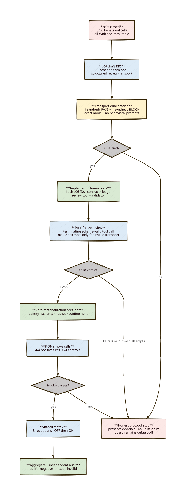

# c06 supersession-guard protocol RFC

**Status:** DRAFT — formal design only; not frozen and not authorized for model qualification, preflight, or behavioral execution.

**Verdict:** c06 should preserve c05’s scientific design and replace only its fragile natural-language review transport. The replacement must prove itself on one synthetic PASS and one synthetic BLOCK before c06 is preregistered or frozen.

## Diagram

## Evidence motivating c06

- c04 was a valid negative experiment, but the guard fired on 0/12 positive ON cells.
- c05 fixed the demonstrated structured-user-input causal defect, added tests and telemetry, corrected the prospective scorer, and passed runtime/freeze verification.
- c05 executed 0/56 behavioral cells because its final substantive review PASS failed a presentation-format gate.
- The independent c05 audit passed requirements 1–7 and 12–13, but blocked review, smoke, matrix, and uplift requirements 8–11.

Therefore c06 changes review transport, not the hypothesis, fixtures, scorer, thresholds, guard default, or production causal fix.

## Decision

Use a Pi extension that registers two schema-validated tools: `read_c06_evidence` and terminating `submit_c06_review`.

The independent reviewer receives only:

- `read_c06_evidence`, confined to a frozen minimal required-path manifest;
- `submit_c06_review`;
- the exact freeze commit and manifest SHA-256.

Mechanical checks—hashes, counts, ordering, identity, ranges, schema, and thresholds—run deterministically before review. The LLM reviewer is retained only for semantic questions that scripts cannot decide: contradictory requirements, unsupported causal assumptions, retrospective-tuning risk, and missing threats to validity.

The raw Pi session is authoritative. Pi writes that JSONL into the command’s fresh confined `--session-dir`; after process exit the harness copies it byte-for-byte into `docs/c06-evidence/` and records its SHA-256. Assistant prose is never parsed and cannot pass or fail the review. A deterministic validator derives canonical review JSON only from that raw session. A successful submission means one schema-valid, cross-field-valid `submit_c06_review` call paired by tool-call ID with one non-error tool result whose normalized `details` match the call arguments. Once that pair exists, later text is preserved but non-authoritative and cannot invalidate or replace it.

### Submission contract

The semantic payload is frozen prospectively in `docs/c06-review-submission.schema.json`:

- `freeze_commit`;
- `scope_sha256`;
- `verdict`: `PASS` or `BLOCK`;
- `summary`;
- `contradictions`;
- `not_found`;
- `blockers`.

`PASS` requires all three finding arrays to be empty. `BLOCK` requires `len(contradictions) + len(not_found) + len(blockers) >= 1`. Every contradiction or blocker requires at least one structured citation: frozen-scope `path`, positive `line_start`/`line_end`, and an exact `quote` from that line range. The tool enforces scope membership, `line_end >= line_start`, and exact quote matching against the pinned file bytes. `summary` is free text for humans and is explicitly non-authoritative. The schema has `additionalProperties: false`; verdict values are exactly `PASS` and `BLOCK`; `freeze_commit` is exactly 40 lowercase hexadecimal characters and must equal the actual frozen commit. `scope_sha256` is SHA-256 over the raw committed bytes of `c06-review-scope.json`, with no parsing or newline normalization. Cross-field rules are enforced by the tool, not by prompt wording.

The TypeScript tools will use TypeBox and `StringEnum` and write no file. `read_c06_evidence` returns bounded text plus structured details containing path, frozen file SHA-256, requested/returned line range, content SHA-256, and completeness. `submit_c06_review` returns normalized arguments in tool-result `details` and sets `terminate: true`. A second successful submission is rejected. Earlier failed schema/tool submissions may exist, but the session must contain exactly one successful submission; later assistant text is ignored.

### Session-backed validation

A review is valid only when all of these pass:

1. Raw session bytes and SHA-256 match the canonical metadata.
2. Session provider/model/thinking are exactly `8081-twins/qwen36-27b-nvidia-nvfp4:off`.
3. Review occurs after the c06 freeze and before preflight.
4. The reviewer command, extension path/hash, child environment, session path, and confinement match the frozen contract.
5. Post-hoc validation of `read_c06_evidence` call/result details proves the union of successful returned ranges covers every manifest-required range before submission, with matching file/content hashes and no truncation.
6. One successful `submit_c06_review` call is paired with one non-error tool result whose `details` equal the validated arguments.
7. Every adverse citation resolves to a required-scope file and exact quoted frozen line range.
8. `freeze_commit` and `scope_sha256` equal the controller-provided frozen values.
9. PASS/BLOCK cross-field rules hold.

Natural-language text, Markdown, headings, whitespace, ordering, and first/last-byte formatting are explicitly outside the validity predicate.

## Minimal review scope

The frozen required-path manifest will contain no more than 20 files. Each entry records repo-relative path, raw SHA-256, byte/line counts, and required line ranges. The review prompt includes the exact absolute repository root plus every required repo-relative path verbatim; `read_c06_evidence` rejects paths outside the manifest, and the session validator checks returned coverage/details. It covers only evidence necessary for a meaningful prospective verdict:

- final c06 preregistration and submission schema;
- c06 contract and required-path manifest;
- review tool and session validator;
- c06 runner, serial controller, aggregate, and freeze verifier;
- fresh ledger and smoke/matrix schedule;
- reused c05 corpus and scorer bytes;
- production causal fix and focused tests;
- current c06 capability/transport qualification result;
- c05 protocol-blocked closure and c04 baseline aggregate.

Every required full-read file must fit the custom reader’s frozen output limit; larger evidence uses frozen explicit ranges. Before freeze, a deterministic scope check must prove that every required range can be returned completely with details matching on-disk bytes. Other contract files are not reviewer inputs or exhaustive read-coverage gates. The contract and verifier remain responsible for byte integrity across the full frozen package.

## Phase Q — transport qualification before preregistration

This phase is engineering qualification, not c06 behavioral evidence.

### Local qualification

TDD must first prove:

- strict schema acceptance/rejection;
- PASS/BLOCK cross-field rules;
- exact freeze/scope binding;
- one-success-only behavior;
- terminating result details without requiring the model to stop speaking;
- raw-session call/result pairing;
- assistant prose is ignored;
- incomplete range coverage and a deliberate no-submission session become deterministic invalid outcomes;
- structured citations reject out-of-scope paths, wrong ranges, and inexact quotes;
- identity, timing, hash, path, and required-read failures stop validation.

### Exact-model qualification

Then run, under fresh `c06-transport-*` IDs:

1. a zero-prompt RPC state probe with two `get_state` controls;
2. one fixed synthetic review whose correct result is PASS;
3. one fixed synthetic review whose correct result is BLOCK.

Both synthetic sessions must use the exact c06 reviewer command and extension hash, read their fixed required inputs through `read_c06_evidence`, and produce a durable schema-valid successful tool result in raw JSONL. Qualification verifies returned details/content against the synthetic on-disk bytes. They deliver no corpus or behavioral prompt and cannot be used as uplift evidence.

If either synthetic case fails, preserve all evidence and stop for human review. Do not create a c06 preregistration or freeze around an unproven transport. Phase Q never modifies c01–c05 artifacts and creates no freeze commit.

## Immutable scientific inputs

After qualification, c06 will hash-reference rather than modify:

- `scripts/behavioral-parcour/c05-supersession-corpus.json`;
- `scripts/behavioral-parcour/c05_scorer.py`;
- the production causal fix in `src/core.ts`;
- focused production tests and telemetry behavior;
- c05’s Pi `0.84.*` / Node `22.*` compatibility policy;
- c05 smoke and matrix thresholds and ordering.

Fixture `before` text, three prompts, positive/control labels, target paths, scorer behavior, and control identities remain byte- and behavior-equivalent to c05. No c06 result may trigger fixture, scorer, prompt, threshold, or production-guard tuning.

c01–c05, all review/preflight failures, freezes, raw sessions, and closures remain immutable historical evidence.

## Fresh c06 boundary

Only fresh c06 artifacts count:

- `.parcour-runs/c06-*` workspaces and sessions;
- `docs/c06-evidence/` capability, qualification, review, preflight, decisions, and aggregate evidence;
- `docs/c06-raw/<run-id>/` raw behavioral publication;
- fresh `c06-*` IDs, contract, ledger, review scope, controller state, and completion audit.

No c05 behavioral record exists to reuse. c04 results remain historical baseline context, not c06 cells.

## Freeze and review

After Phase Q passes:

1. implement and test the complete c06 harness;
2. create the final c06 preregistration, D2/SVG, contract, required-path manifest, 56-entry ordered unconsumed ledger, and 56 empty raw placeholders;
3. commit one c06 freeze;
4. verify current and frozen bytes before review;
5. run the structured independent review.

The review retry rule is asymmetric by design:

- a valid `PASS` authorizes preflight;
- a valid `BLOCK` is final and is never retried;
- an attempt is invalid only when no schema-valid, cross-field-valid `submit_c06_review` call/result pair exists, including process/connection failure before such a pair;
- an invalid attempt may be retried exactly once;
- verdict content never triggers a retry;
- attempt 2 uses the byte-identical prompt and frozen inputs in a fresh session, with no added hint or attempt-1 error text;
- every attempt is published; canonical metadata records any parseable attempted verdict from failed tool arguments but never infers a verdict from prose;
- the frozen reviewer command supplies no seed or temperature override, so retry is justified only as a transport-liveness allowance, not as semantic resampling;
- each attempt has a frozen 20-minute wall-clock cap; expiry without a successful submission is invalid;
- no parser, schema, extension, scope, contract, freeze, identity, or policy change is allowed between attempts;
- attempt 2 is final regardless of outcome; two invalid attempts produce protocol-blocked closure.

This prevents verdict shopping: BLOCK is never retried while PASS is accepted.

## Runtime and mandatory gates

- Reviewer and every behavioral executor use `8081-twins/qwen36-27b-nvidia-nvfp4`, thinking `off`; smoke/matrix ON versus OFF changes only the default-off guard workspace setting, never model identity.
- Pi compatibility: `0.84.*`; Node compatibility: `22.*`; exact strings remain provenance.
- Actual nested `get_state.data.model.provider`, `.id`, and `data.thinkingLevel` are verified.
- Child `CONSORTIUM_MODEL` is explicitly overwritten.
- Command identity, effective consortium model, extension hashes/order, schema, safety, confinement, raw evidence, ledger order, process exit, and publication remain strict.
- Schema/identity/infrastructure/review/preflight/raw-evidence failures stop immediately.
- Behavioral failures are published only where the frozen schedule permits continuation.
- The guard remains default-off throughout.

## Zero-materialization preflight

After a valid structured PASS, run one fresh preflight before prompt 1. It must verify all frozen gates and materialize none of the 56 scheduled runtime roots, raw artifacts, or ledger records.

A preflight failure is preserved and closes c06 as protocol-blocked. It is not repaired retrospectively.

## Behavioral schedule

### Smoke

Execute exactly eight fresh ON cells in c05 corpus order:

1. yaml-markdown;
2. policy-retirement;
3. requirement-replacement;
4. state-format-migration;
5. state-formatting-control;
6. policy-clarification-control;
7. requirement-addition-control;
8. state-comment-control.

All eight run to preserve the denominator after a behavioral failure. Matrix authorization requires:

- all eight cells have valid identity/process/raw evidence and three prompts;
- positive guard fires: 4/4;
- positive continuity: 4/4;
- control guard fires: 0/4;
- control regressions: 0/4.

A failed smoke produces an honest mechanism/control outcome and categorically blocks the matrix. Smoke is gating-only: its eight runs are reported separately and are never pooled into the 48 matrix cells or uplift denominators.

### Matrix

Only a committed valid smoke decision authorizes 48 cells:

- repetitions 1, 2, then 3;
- eight fixtures in frozen corpus order;
- OFF then ON for each fixture;
- no retries or substitutions.

Behavioral failures consume and publish their scheduled cell and do not suppress later frozen matrix cells.

## Result predicates

A complete matrix reports per-cell and paired:

- mechanism/guard fire;
- continuity;
- control preservation/regression;
- identity, process, and raw validity;
- latency and elapsed time;
- tool-call counts;
- failed assertions and evidence hashes.

**Bounded uplift is established only if:**

- all 12 ON-positive cells fire;
- all 12 OFF-positive cells do not fire;
- all 24 controls do not fire;
- ON continuity is at least 11/12;
- ON continuity is at least 3 cells above paired OFF;
- control regressions are 0/24;
- all mandatory evidence is valid.

A valid matrix that misses uplift thresholds is an honest negative or mixed result, not a protocol failure. Experimental success means obtaining a valid answer; uplift is one possible answer.

## Process-cost stop rule

c06 has one pre-behavior path: Phase Q → one implementation/freeze package → at most two post-freeze review attempts → one preflight → smoke cell 1.

If that path does not reach smoke cell 1, publish protocol-blocked closure. Do not add a second freeze, third review attempt, alternate parser, alternate model, or new gate within c06.

The first minimum honest-progress milestone is eight valid smoke cells. It proves or rejects live mechanism activation before matrix cost.

## Publication and conclusions

Publish exactly one final classification:

- protocol-blocked before behavior;
- smoke mechanism/control failure;
- complete valid bounded uplift;
- complete valid no-uplift/mixed result;
- invalid behavioral result with exact failed gate.

Preserve positive, negative, mixed, invalid, timeout, connection, and raw evidence unchanged. Obtain an independent requirement-to-artifact completion audit. Recommend retain/remove/continue-study, but never automatically enable or remove the guard.

## Risks and controls

| Risk | Control |
|---|---|
| Tool-result `details` are not durable in this runtime | Verify raw JSONL bytes in Phase Q before freeze |
| Model ignores or misuses the submission tool | Synthetic PASS/BLOCK qualification; hard stop |
| Structured review becomes another overconstrained gate | Ignore prose; keep ≤20 scoped inputs; enforce one semantic schema and structured reader |
| Retry selects for PASS | Retry only absence of a valid verdict; publish failed arguments; never retry valid BLOCK |
| Same-model reviewer shares executor blind spots | Declare this threat; restrict review to semantic consistency and retain independent human approval |
| c06 silently changes the science | Hash-reference c05 corpus/scorer and test parity |
| Gate work expands indefinitely | One-freeze/two-review/one-preflight process-cost cap |
| Historical evidence is reclassified | Fresh c06 paths and immutable c01–c05 boundary |

## Implementation plan after approval

Prospective files/components:

- `scripts/behavioral-parcour/c06_review_tool.ts` registering `read_c06_evidence` and `submit_c06_review`;
- `scripts/behavioral-parcour/c06_phase0.py` and qualification helper/tests;
- `scripts/behavioral-parcour/c06_runner.py` with structured session validation;
- `scripts/behavioral-parcour/c06_controller.py` and `c06_aggregate.py`;
- `scripts/behavioral-parcour/verify_c06_freeze.py` and focused tests;
- `scripts/behavioral-parcour/c06-contract-files.json` and `c06-review-scope.json`;
- `docs/c06-evidence/`, `docs/c06-raw/`, final preregistration/status/audit artifacts.

No `src/` production change is planned. Any need to change production guard logic, corpus, scorer, prompt, threshold, dependency, or model is a scope change requiring a new human decision.

## Verification plan

1. TDD the tool and raw-session validator.
2. Run focused TypeScript/Python tests and full repository tests/typecheck/audit/precommit.
3. Run Phase Q state, synthetic PASS, and synthetic BLOCK qualification only after explicit approval.
4. Review Phase Q evidence before authorizing final preregistration/freeze work.
5. After freeze, execute gates and cells serially with hash-pinned evidence.
6. Independently audit every requirement before final classification.

## Approval boundary

Approval of this RFC should authorize **Phase Q implementation and qualification only**. It must not authorize creating a freeze commit, preflight, smoke, or matrix execution. Completing Phase Q does not authorize the freeze: Phase Q evidence returns to the human, and a new explicit human approval is required before final preregistration and the freeze commit.
